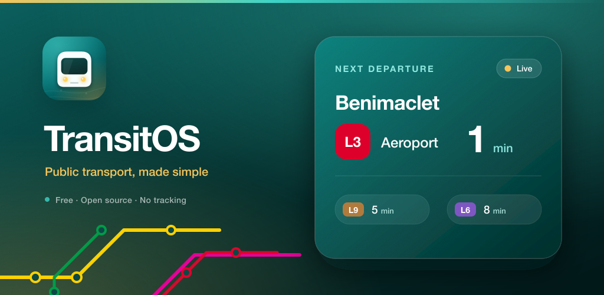
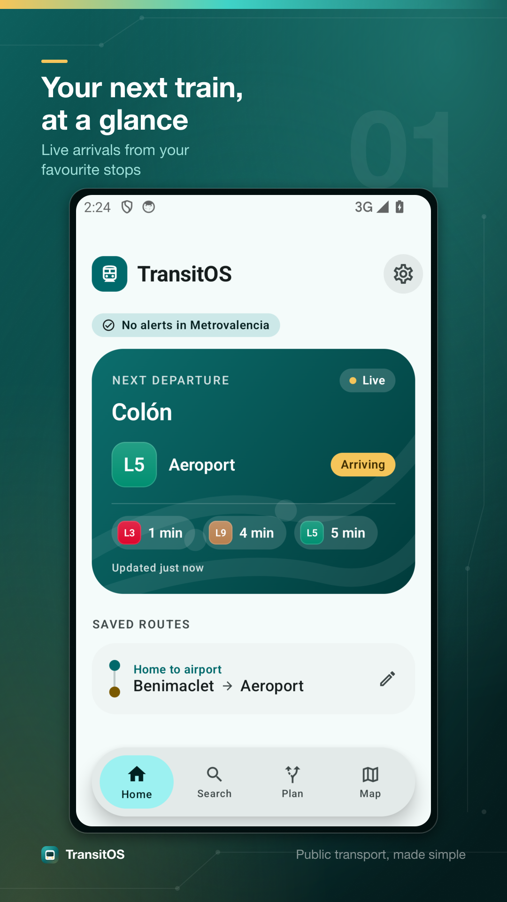
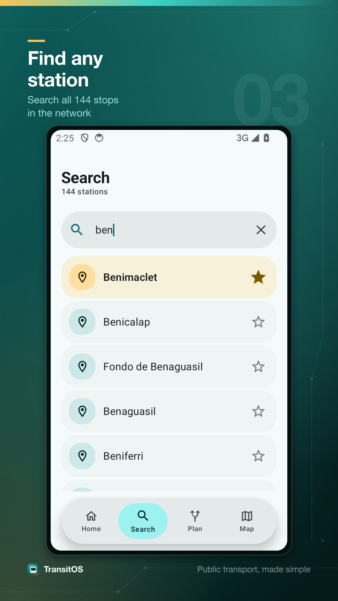
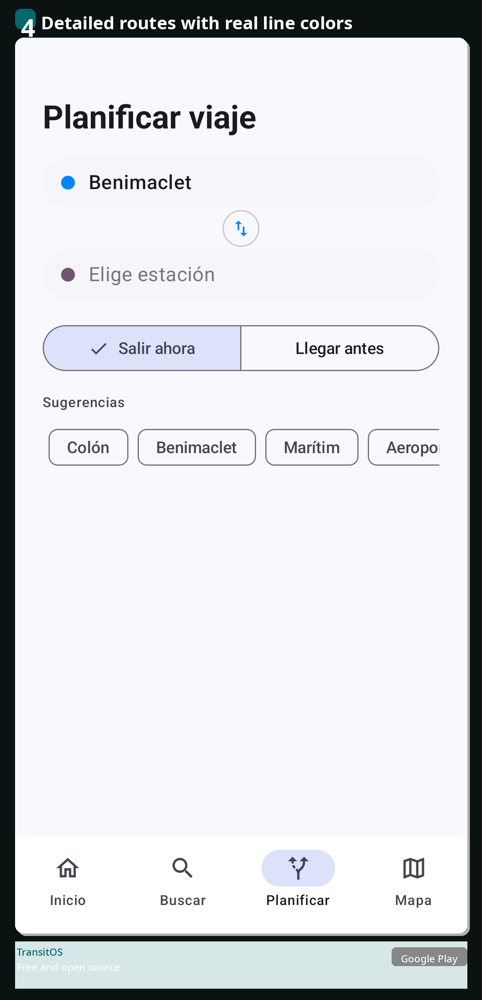
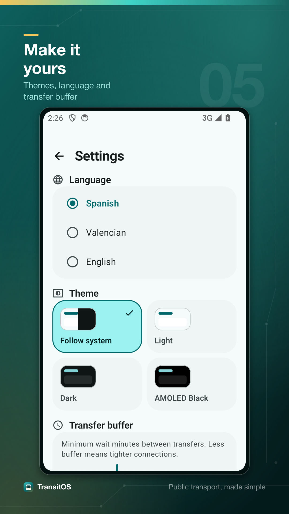
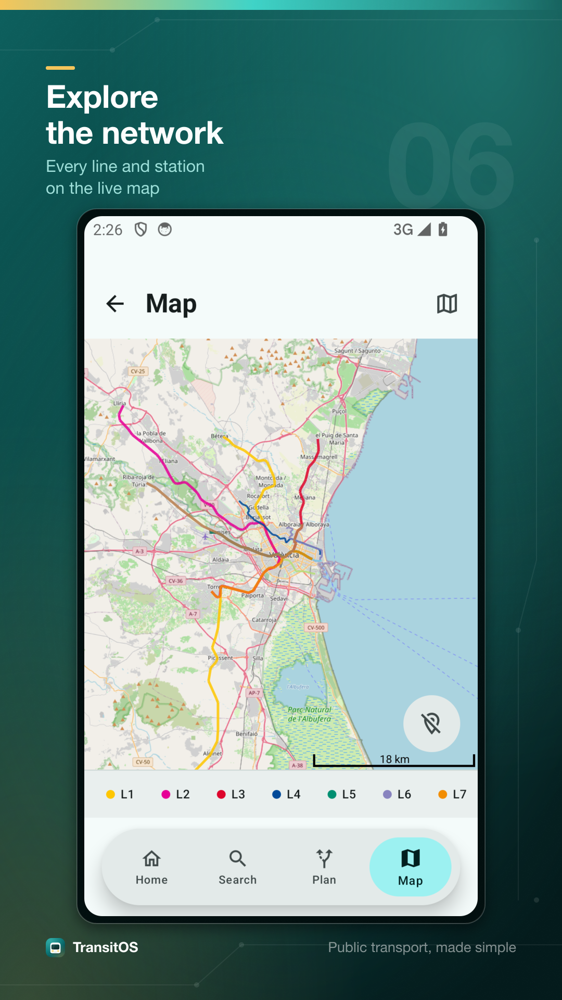

<div align="center">

# TransitOS

**The open-source public transport app. Fast, calm, private.**

The Breezy Weather of transit: no ads, no tracking, just the next arrivals.

[](https://kotlinlang.org)
[](https://developer.android.com/jetpack/compose)
[](./LICENSE)
[](https://github.com/IgnacioLD/TransitOS/releases)
[](./CONTRIBUTING.md)

</div>

<p align="center">
  
</p>

TransitOS is an open-source Android client for public transport, starting with
**Metrovalencia** (FGV) and built to grow into a multi-operator platform (EMT
Valencia, Renfe Cercanias, and beyond). It is free as in freedom, funded by
nobody, and respects your privacy.

---

## Highlights

- **Live arrivals** for every Metrovalencia line and station.
- **Trip planner** with multiple journey alternatives, departure or arrival time
  modes, and a configurable transfer buffer.
- **Interactive network map** with all stations, official line colors, and
  polylines rendered on OpenStreetMap tiles.
- **Saved routes** with custom labels ("Home", "Work") for one-tap access.
- **Station search** across the whole network.
- **Multilingual**: English, Spanish, and Valencian.
- **Themeable**: System, Light, Dark, and AMOLED pure black.
- **Offline-friendly PDF map** that you can download to your device.
- **No ads. No tracking. No analytics.** Period.

## Screenshots

<p align="center">
  
  
  
  
  
</p>

## Download

Pre-built APKs are available on the
[releases page](https://github.com/IgnacioLD/TransitOS/releases/latest).

> TransitOS is not on Google Play yet. Sideload the APK, or build it yourself.

## Build

Requires **JDK 17** and **Android SDK 35** (Platform 35 + Build Tools).

```bash
# Debug APK
./gradlew :app:assembleDebug

# Release APK (needs a signing keystore, see below)
./gradlew :app:assembleRelease
```

The debug APK lands in `app/build/outputs/apk/debug/`.

### Signing a release build

Release signing reads `app/keystore.properties` (gitignored, never committed).
Create one with:

```properties
storeFile=release.keystore
storePassword=<your-store-password>
keyAlias=<your-key-alias>
keyPassword=<your-key-password>
```

Then place your `.jks` / `.keystore` next to it in `app/`. Without this file,
release builds are still produced but left unsigned.

## Architecture

TransitOS uses strict clean layering with a one-way dependency direction.
Read the full guide in [`ARCHITECTURE.md`](./ARCHITECTURE.md).

```
Presentation (app, feature-*, core-ui, core-design)
        |  depends on
        v
Domain (core)  -> models, repository contracts, AppResult
        |  implemented by
        v
Data (provider-*, core-network, core-data)  -> repository impls, Ktor, DataStore
```

### Module map

| Module                    | Layer        | Responsibility                                              |
| ------------------------- | ------------ | ----------------------------------------------------------- |
| `:app`                    | Presentation | Application, DI wiring, navigation, bottom bar, network map |
| `:core`                   | Domain       | Universal models, `TransitRepository` contract, `AppResult` |
| `:core-data`              | Data         | DataStore-backed preferences and favorites repositories     |
| `:core-network`           | Data         | Shared Ktor `HttpClient` factory, Koin network module       |
| `:core-design`            | Presentation | Material 3 theme: color, typography, shapes, elevation      |
| `:core-ui`                | Presentation | Shared composables (`LoadingState`, `ErrorState`, badges)   |
| `:feature-home`           | Presentation | Home and favorites screen + ViewModel                       |
| `:feature-search`         | Presentation | Station search screen + ViewModel                           |
| `:feature-planner`        | Presentation | Trip planner screen + ViewModel                             |
| `:feature-settings`       | Presentation | Settings, theme, language, about screen                     |
| `:provider-metrovalencia` | Data         | `TransitRepository` implementation for Metrovalencia (FGV)  |

Adding a new operator (for example EMT) means adding one `:provider-emt` module,
implementing `TransitRepository`, and registering its Koin module in `:app`.
Nothing else in the app changes.

## Tech stack

- **Kotlin 2.0.21** with Coroutines and Flow
- **Jetpack Compose** (BOM-managed), Material 3, dynamic color
- **Ktor 3** for networking, **Koin 4** for dependency injection
- **DataStore** for preferences, **osmdroid** for the network map
- **Gradle Version Catalog** (`gradle/libs.versions.toml`) as a single source of truth
- minSdk 26, target / compile SDK 35

## Contributing

Contributions are welcome. Whether it is a bug report, a new translation, a new
provider, or a feature, start by reading [`CONTRIBUTING.md`](./CONTRIBUTING.md).

Good first issues are tagged `good first issue`. Translation help is always
appreciated: see the i18n section of the contributing guide.

## Acknowledgements

- [Metrovalencia / FGV](https://www.metrovalencia.es) for operating the network.
- [OpenStreetMap](https://www.openstreetmap.org) contributors for the map tiles.
- Inspired in spirit by [Breezy Weather](https://github.com/breezy-weather/breezy-weather)
  and the wider FOSS Android community.

## License

Copyright (c) 2025 the TransitOS contributors.

Released under the [GNU AGPL-3.0](./LICENSE). This is a deliberate choice: any
improved version of TransitOS, even one offered as a hosted service, must
publish its source under the same terms.
